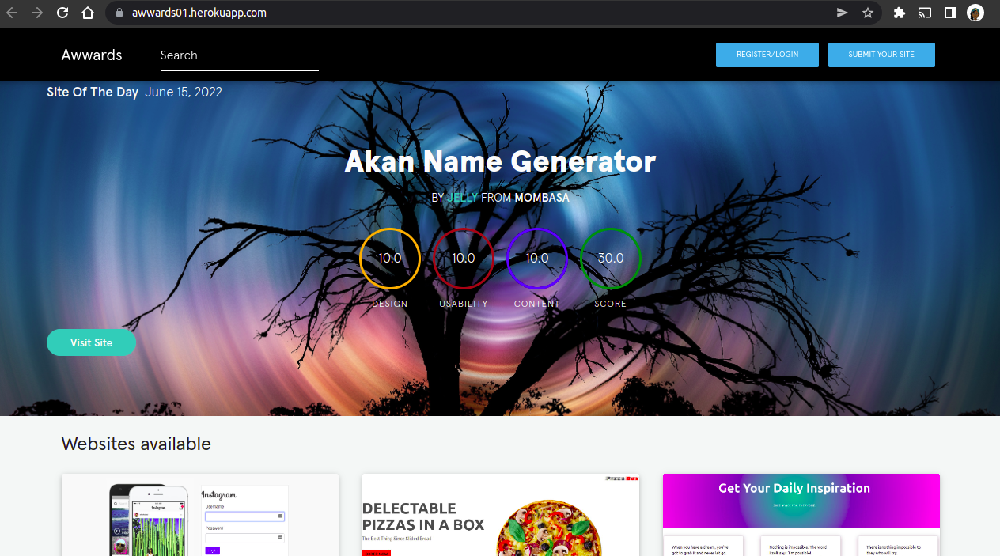
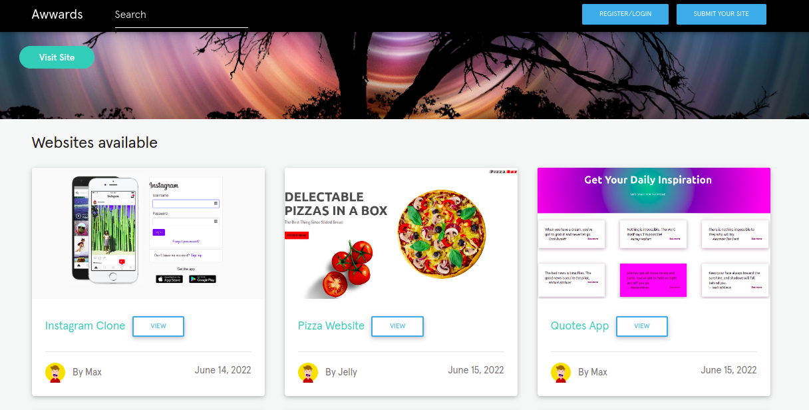

***

# Awwards

---

## Author
> [Joyce Nguttu](https://github.com/joycodes)
***

## Description
>This is a Django application which allows users to post their projects for other users to rate according to design, usability and content 





---

## User Story  
  
* A user can view posted projects and their details.  
* A user can post a project to be rated/reviewed. 
* A user can rate/ review other users' projects.  
* Search for projects.  
* View projects overall score.
* A user can view their profile page. 

---

## Live Link
[View Site](https://.herokuapp.com/)

***

## Setup/Installation Requirements
To get the code..
Cloning the repository:
 https://github.com/joycodes/awwards-clone.git
  
Move to the folder and install requirements
  ```bash
  cd awwards
  pip install -r requirements.txt
  ```
Setup Configurations and  Database
  ```bash 
  python3 manage.py makemigrations app 
  ``` 
Running the application
  ```bash
  python3 manage.py runserver
  ```
  
Testing the application
  ```bash
  python3 manage.py test
  ```
Open the application on your browser 
[127.0.0.1:8000](http://127.0.0.1:8000/)

---

## Technologies Used
>* HTML
>* CSS
>* JS
>* Bootstrap
>* Python3.8
>* Django 4.0.5
>* PyUploadcare 2.6.0
>* Heroku
 
---

## Support and Contact Information
> The application is an open-source product if you  want to improve on it or include an event of a bug  contact this
> https://www.linkedin.com/in/jnguttu/ .
***
## License
The project is [MIT](LICENSE) licensed 